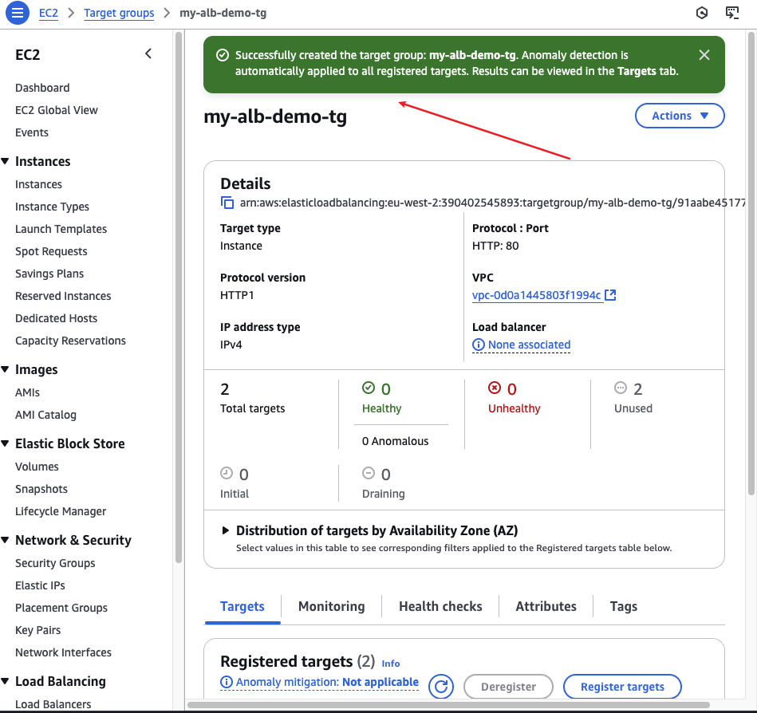
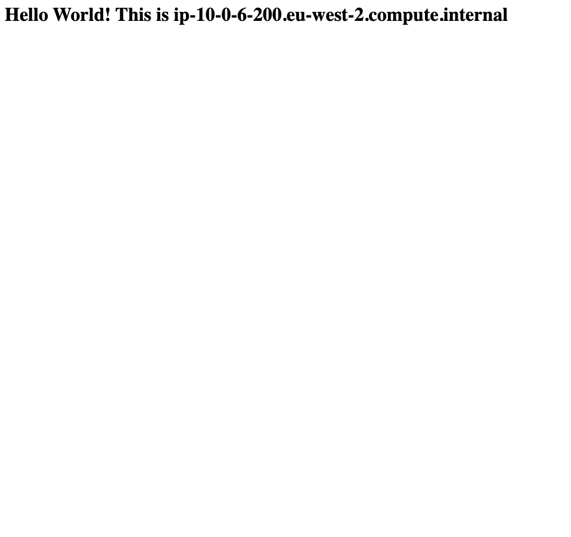

# Load-balancer-and-Autoscaling-Group
This load balancer and Autoscaling Group

This project will be divided into 2 stages:

1. Setting up an Application Load Balancer (ALB)
2. Configuring the Auto Scaling Group.

1. ## Stage 1: Setting up the Application Load Balancer

An Application Load Balancer is a type of load balancing service that distributes incoming application traffic across multiple targets, such as EC2 instances.

### Step 1: Setting up ALB

1. **Create 2 EC2 Instances:**
   - The first instance i have the following configuration:

- A new security group is created with SSH and HTTP inbound rules:

 - I Follow the same process for the second EC2 instance:

- Both EC2 instances were created successfully:

2. **Test the Instances:**
   - I click on the first instance and copy the IP address to paste into a web browser:

 - The first instance is working properly:

 - I Follow the same procedure for the second instance:

 - The second instance is working perfectly:

3. **Create a Load Balancer:**
   - From the EC2 console,i scroll down to Load Balancers and click on it:

- i Click on "Create Load Balancer":

 - i Choose to create a flexible feature set for applications with HTTP traffic:

- During the process, i create a new security group and a new target group to add to your traffic:

 - I added a new name and allow HTTP port 80, and select my previous VPC:

added a new name and allow HTTP port 80

ip address IPV4

i Selected both instances and click on "Include as pending below"

- The target group is successfully created. I return to the load balancer and complete the creation:

- A summary of the application load balancer configuration:

 - Name: `my-alb`
     - Scheme: Internet-facing
     - IP Address Type: IPv4
     - Security Group: `alb-demo-sg-1` (allows port 80 and HTTP traffic)
     - Network Mapping: Use the available network zones in the VPC
     - Listener and Routing: Allow HTTP port 80 and connect to `my-alb-demo-tg` on the target group

> > The load balancer was created successfully and is in an active state.

### Testing the Load Balancer

1. **Copy the DNS Name:**

   - i Copy the DNS name of the load balancer and paste it into a web browser to confirm it is working properly.

 - I refreshed the page, the IP address  change to another host, indicating that traffic is being routed between the two instances.

**Simulate an Instance Failure:**
   - If something goes wrong with the first instance, you can simulate this by stopping one of the instances:

- i refresh the page and notice that one instance has stopped working while the other is still running:

- I procced to the target group and choose the demo target group, it show that one instance is healthy and the other is unused. This indicates the result of stopping the instance. Return to the load balancer and refresh the page to see that only one instance is hosting:

## PART 2

### Creating an Auto Scaling Group

1. **Search for Auto Scaling Group:**

   - I Proceed to the search bar on the AWS console, search for "Auto Scaling Group" and click on it.

2. **Create a Launch Template:**
   - After getting to the Auto Scaling Group console, i proceed to create a launch template.

     

3. **Configure the Launch Template:**
   - I Navigate to the new tab where you have the launch template.
   - I Choose a name for my template
 (`my-new-asg-lt`).

   - In the quick start section i choose the AWS Management Console. This will provide me with a pre-configured AWS Machine to launch instances.
   - For instance type, i choose  `t2.micro`.

   - I Proceed to create a new key pair (`my-new-key`) and attach it to my public subnet that allows access to traffic flow on my web browser.

     
     

4. **Auto Scaling Template Creation:**
   - The Auto Scaling template is successfully created. I return to the Auto Scaling Group console and proceed.

     

5. **Create the Auto Scaling Group:**
   - During the process of creating the Auto Scaling group, i provide a name for my Auto Scaling group (`New-asg`).

   - I launch with the template i  already created (`my-new-asg-lt`)

     

   - I attach it to my VPC and allow all available networks.

   - I attach both subnets that allow HTTP PORT-80.

     

6. **Set Desired Capacity:**
   - I choose 1 for Min desired capacity and 4 for Max desired capacity.

     

7. **Auto Scaling Group Creation:**
   - The Auto Scaling group is successfully created.

     

8. **Instance Creation:**
   - The Auto Scaling Group has successfully created instances according to the desired capacity specified, which in this case is 2.

     

9. **Verify Load Balancer:**
   - I navigate to the Load Balancer on the EC2 page and notice that the load balancer has also been created.

     

## Project Reflection

- Explored the significance of high availability and scalability in cloud infrastructure.
- Understood the concept of Auto Scaling groups and how they dynamically adjust the number of instances based on workload.

